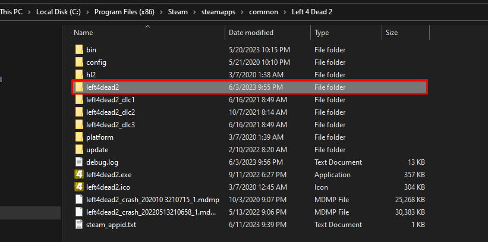
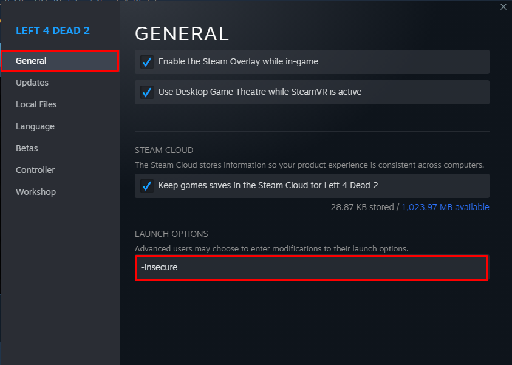

A Left 4 Dead 2 local server for Windows, that will allow you to make campaign lobby with any amount of players you want.

This is the finished version of the guide:
- [Play Left 4 Dead 2 with more than 4 players in Campaign - 2024 Local Server (8+ players update)](https://steamcommunity.com/sharedfiles/filedetails/?id=2987986639)

in case you want to skip all the desribed steps and need the correct files to paste and run the server as soon as possible.

## Install
1. Download this repo and paste all the files from `left4dead2` folder in their respective folders in your game files location (eg: `C:\Program Files (x86)\Steam\steamapps\common\Left 4 Dead 2\left4dead2`)

    

2. Subsribe to [8 slots lobby fixed](https://steamcommunity.com/sharedfiles/filedetails/?id=2754956355) addon
3. Add `-insecure` launch option for the game

    

That is it, you can now start local server and play, if you want more details check the guide.

### Edit [this line](https://github.com/Arxero/l4d2-local-server-win/blob/3d78808cdc75e062cdfbb6fd5ade82f6e3bca23b/left4dead2/addons/sourcemod/configs/admins.cfg#L42) to add yourself as admin